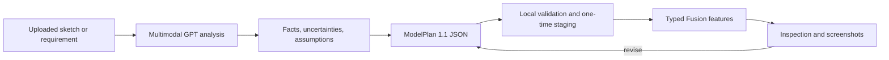

# Fusion AI Modeler

[](https://github.com/langxie29-cpu/fusion360withcodex/actions/workflows/tests.yml)
[](LICENSE)

A safe, multimodal sketch-to-CAD workflow for Autodesk Fusion. Upload a hand sketch,
dimensioned drawing, reference image, or mechanical requirement to a capable GPT client;
the bundled Codex skill converts it into a validated, editable Fusion model without exposing
arbitrary Python execution inside Fusion.

> **Status:** `v0.2.0` alpha. ModelPlan 1.1 adds multi-plane sketches, slots, compound holes,
> chamfers, typed patterns, result assertions, and a detailed mecanum drive-module generator.
> Loft, sweep, threads, joints, and export are not yet part of the typed protocol.

中文简介：这是一个面向 Fusion 的安全型 AI 参数建模项目。GPT 负责理解上传的草图，
`ModelPlan` 负责表达可审计的建模意图，本机 Fusion Add-In 只执行白名单特征并返回多视图截图。

## Why this project

Many CAD bridges expose a general-purpose code execution tool. Fusion AI Modeler uses a
smaller, auditable interface instead:



The model cannot send arbitrary Python, shell commands, file paths, or material scripts to
Fusion. All writes must pass the versioned ModelPlan validator and a separate stage/review step.

## Included

- Repository-scoped Codex skill in `.agents/skills/fusion-ai-modeler`.
- Localhost-only Fusion Add-In in `fusion-addin/FusionAIModeler`.
- Dependency-free ModelPlan validator and JSON Schema.
- Parameters and typed features:
  - boxes and X/Y/Z-axis cylinders;
  - rectangle, circle, closed polyline, tangent rounded-rectangle, annulus, and angled-slot profiles;
  - positive or negative XY, XZ, and YZ sketch extrusion;
  - simple, counterbored, or countersunk holes, blind or through-all;
  - constant-radius edge fillets and equal-distance chamfers on named bodies;
  - one- or two-direction rectangular patterns and axis-driven circular patterns;
  - a detailed mecanum wheel, coupler, geared motor, bracket, and hardware assembly feature;
  - final body-count, required-body, and bounding-size assertions;
  - constrained appearance presets for silver metal, glass, black glass, and flash details.
- Plan staging with a 30-minute expiry and one-time plan IDs.
- Active-design inspection and orthographic/isometric viewport screenshots.
- A small candidate catalog for motors, bearings, and fasteners with an explicit
  "verify the exact part number" policy.

## Detailed, original examples

The repository includes brand-neutral examples for several application patterns.
They demonstrate different application patterns without copying proprietary product geometry:

| Example | Application | Detail level |
| --- | --- | --- |
| [Generic sensor enclosure](examples/generic-sensor-enclosure.modelplan.json) | Desktop or industrial sensing | Rounded shell and lid, vents, optical window, fasteners, status light, service button |
| [Robotics control panel](examples/robotics-control-panel.modelplan.json) | Robot or lab controller | Display recess and glass, rotary and push controls, indicators, rear standoffs |
| [Configurable stepper mount](examples/configurable-stepper-mount.modelplan.json) | Generic motor integration | Parametric pitch, locating ring, annular spacers, frame holes, ribs, isolation pads |
| [Generic mecanum drive module](examples/generic-mecanum-drive-module.modelplan.json) | Mobile robotics drive integration | Nine angled barrel rollers, detailed hub, coupler, geared motor, bracket, fasteners, result checks |

These are editable design examples, not manufacturing specifications. Verify loads, tolerances,
clearances, sealing, materials, and the exact purchased-part interfaces for the real application.

## Requirements

- Autodesk Fusion on Windows or macOS.
- Codex or another MCP-capable client that can use repository skills and Streamable HTTP.
- A multimodal model when the input is an image.
- Python 3.10+ only for local validation/tests; the Fusion Add-In uses Fusion's bundled Python.

## Quick start

### 1. Install the Fusion Add-In

On Windows, run from PowerShell:

```powershell
./scripts/install_fusion_addin.ps1
```

The installer refuses to overwrite an existing installation. To upgrade, stop Fusion,
back up or remove the existing `FusionAIModeler` directory, then run the installer again.

On macOS, copy `fusion-addin/FusionAIModeler` to:

```text
~/Library/Application Support/Autodesk/Autodesk Fusion 360/API/AddIns/FusionAIModeler
```

### 2. Start the bridge

In Fusion, open **Utilities > Scripts and Add-Ins > Add-Ins**, select
`FusionAIModeler`, and click **Run**. The manifest enables `runOnStartup` for later sessions.

The server binds only to `127.0.0.1:9100`. The repository already contains the Codex MCP
configuration at `.codex/config.toml`.

### 3. Open this repository in Codex

Upload a sketch and ask, for example:

> Use `$fusion-ai-modeler` to turn this dimensioned sketch into a new editable Fusion model.
> Treat millimetres as the source unit, ask only about topology-changing ambiguities, and
> return top, side, and isometric screenshots.

The skill can also inspect or revise the active design when the user explicitly requests an
in-place edit.

In another Codex task opened from this repository or from the configured `robot` project, upload
the sketch directly to GPT and mention `$fusion-ai-modeler`. For example:

> Use `$fusion-ai-modeler` to build this uploaded sketch in Fusion. Use ModelPlan 1.1, preserve
> uncertain dimensions as parameters, validate before staging, and return orthographic plus
> isometric screenshots.

For a wheel module, validate and stage
`examples/generic-mecanum-drive-module.modelplan.json`. Change `side` and `handedness` for each
corner and visually verify the roller-axis pattern before treating it as a four-wheel chassis.

## ModelPlan example

Validate the bundled motor-plate example without opening Fusion:

```powershell
python .agents/skills/fusion-ai-modeler/scripts/validate_model_plan.py `
  .agents/skills/fusion-ai-modeler/assets/model-plan.example.json
```

Search the candidate parts catalog:

```powershell
python .agents/skills/fusion-ai-modeler/scripts/search_parts.py "NEMA17"
```

Every physical length is a unit-bearing string or a Fusion parameter expression:

```json
{
  "id": "base",
  "type": "sketch_extrude",
  "operation": "new_body",
  "profile": {
    "shape": "rounded_rectangle",
    "center": ["0 mm", "0 mm"],
    "width": "60 mm",
    "height": "40 mm",
    "radius": "4 mm"
  },
  "distance": "3 mm"
}
```

## Security model

- The HTTP server binds to the loopback interface only.
- POST requests require a loopback `Host`, a trusted/absent `Origin`, and
  `Content-Type: application/json` to block browser cross-site writes.
- Requests are limited to 1 MiB; ModelPlans are limited to 256 KiB.
- Fusion's main thread receives only a short, expiring, single-use plan ID.
- There is no arbitrary code execution tool.
- New documents are the default. The active document is changed only on explicit request.
- A plan failure closes the newly-created document instead of leaving a partial build.

See [SECURITY.md](SECURITY.md) for the threat model and vulnerability reporting process.

## Development

Run the release checks with only the Python standard library:

```powershell
python -m unittest discover -s tests -v
python scripts/check_release.py
python -m compileall -q fusion-addin/FusionAIModeler `
  .agents/skills/fusion-ai-modeler/scripts tests
```

The CI workflow runs these checks on Windows and Linux. Fusion API integration itself must be
smoke-tested in Fusion because Autodesk's `adsk` module is only available inside the application.

## Repository layout

```text
.agents/skills/fusion-ai-modeler/   Codex skill, schema, references, and scripts
.codex/config.toml                  Project-local MCP connection
fusion-addin/FusionAIModeler/       Fusion Add-In and typed executor
scripts/                            Installer and release checks
tests/                              Dependency-free unit tests
```

## Roadmap

- face-attached sketches, pockets, lofts, and sweeps;
- STEP, STL, and F3D export through typed tools;
- typed joints and broader purchased-part interface workflows;
- broader geometric assertions and Fusion-driven integration fixtures;
- broader appearance-library localization.

## License and attribution

Project-specific additions are licensed under the [MIT License](LICENSE). The HTTP MCP server,
main-thread bridge, primitive helpers, and screenshot foundation are derived from Autodesk's
MIT-licensed `AutodeskFusion360/FusionMCPSample`; its license is retained at
`fusion-addin/FusionAIModeler/LICENSE.autodesk.txt`. See [THIRD_PARTY_NOTICES.md](THIRD_PARTY_NOTICES.md).

Autodesk, Fusion, OpenAI, Codex, and other product names are trademarks of their respective
owners. This community project is not affiliated with or endorsed by Autodesk or OpenAI.
